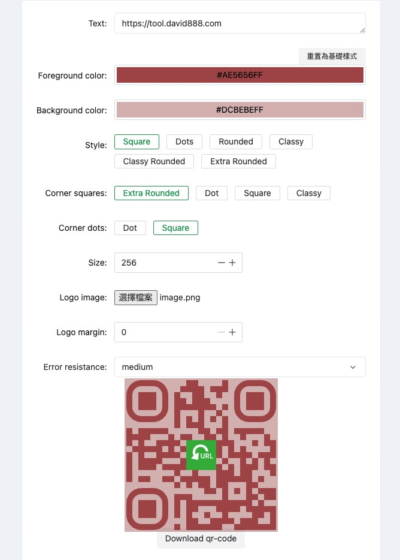

<picture>
    <source srcset="./.github/logo-dark.png" media="(prefers-color-scheme: light)">
    <source srcset="./.github/logo-white.png" media="(prefers-color-scheme: dark)">
    
</picture>

<p align="center">
一套為開發者與 IT 工作者準備的線上工具集合。<a href="https://tool.david888.com">立即體驗！</a>
</p>

**致謝**：感謝原作者 [CorentinTh/it-tools](https://github.com/CorentinTh/it-tools) 的開源專案。

**本版本更新**

| # | 更新內容 |
| --- | --- |
| 1 | 預設介面語言改為繁體中文 |
| 2 | 新增「同文堂繁簡轉換器」工具，可離線完成簡體/繁體互轉（https://tool.david888.com/tongwen-converter） |
| 3 | QR Code 生成器升級：支援 qr-code-styling，多種樣式（Square/Dots/Rounded/Classy 等）、角落樣式、尺寸、Logo 上傳與邊距，並保留一鍵重置為基礎樣式（https://tool.david888.com/qrcode-generator） |
| 4 | QR 解析工具：新增支援貼上剪貼簿圖片直接解析（https://tool.david888.com/qr-checker） |
| 5 | 新增「倒數計時器」工具（Measurement 分類），可設定時/分/秒並快速加時間、複製剩餘時間（https://tool.david888.com/countdown-timer） |
| 6 | 新增「特殊字體產生器」工具（Text 分類），一鍵輸出多種 Unicode 特殊字型並可快速複製（https://tool.david888.com/fancy-text） |
| 7 | 新增「世界時間」工具（Measurement 分類），快速查看多城市時間並切換 12/24 小時制（https://tool.david888.com/world-clock） |



## Functionalities and roadmap

Please check the [issues](https://github.com/tbdavid2019/it-tools/issues) to see if some feature listed to be implemented.

You have an idea of a tool? Submit a [feature request](https://github.com/tbdavid2019/it-tools/issues/new/choose)!

## Deploy to Vercel

1. 將程式碼推上 GitHub/GitLab（`dist` 繼續保留在 `.gitignore`）。
2. 在 Vercel 匯入專案，Framework 選「Vite」。
3. 安裝指令：`pnpm install --frozen-lockfile`（可用預設）；Build 指令：`pnpm build`；Output Directory：`dist`。
4. 需要環境變數的話，於 Vercel 專案設定補上後重新部署。
5. 首次部署完成後即可透過 Vercel 提供的網址存取。


## 本地測試
啟動開發伺服器：pnpm dev，預設會跑在 http://localhost:5173

如需預覽正式建置：pnpm build 後 pnpm preview（預設 http://localhost:5050）

```
pnpm install
pnpm dev
```
```
pnpm build
pnpm preview
```


## Contribute

### Recommended IDE Setup

[VSCode](https://code.visualstudio.com/) with the following extensions:

- [Volar](https://marketplace.visualstudio.com/items?itemName=Vue.volar) (and disable Vetur)
- [TypeScript Vue Plugin (Volar)](https://marketplace.visualstudio.com/items?itemName=Vue.vscode-typescript-vue-plugin).
- [ESLint](https://marketplace.visualstudio.com/items?itemName=dbaeumer.vscode-eslint)
- [i18n Ally](https://marketplace.visualstudio.com/items?itemName=lokalise.i18n-ally)

with the following settings:

```json
{
  "editor.formatOnSave": false,
  "editor.codeActionsOnSave": {
    "source.fixAll.eslint": true
  },
  "i18n-ally.localesPaths": ["locales", "src/tools/*/locales"],
  "i18n-ally.keystyle": "nested"
}
```

### Type Support for `.vue` Imports in TS

TypeScript cannot handle type information for `.vue` imports by default, so we replace the `tsc` CLI with `vue-tsc` for type checking. In editors, we need [TypeScript Vue Plugin (Volar)](https://marketplace.visualstudio.com/items?itemName=Vue.vscode-typescript-vue-plugin) to make the TypeScript language service aware of `.vue` types.

If the standalone TypeScript plugin doesn't feel fast enough to you, Volar has also implemented a [Take Over Mode](https://github.com/johnsoncodehk/volar/discussions/471#discussioncomment-1361669) that is more performant. You can enable it by the following steps:

1. Disable the built-in TypeScript Extension
   1. Run `Extensions: Show Built-in Extensions` from VSCode's command palette
   2. Find `TypeScript and JavaScript Language Features`, right click and select `Disable (Workspace)`
2. Reload the VSCode window by running `Developer: Reload Window` from the command palette.

### Project Setup

```sh
pnpm install
```

### Compile and Hot-Reload for Development

```sh
pnpm dev
```

### Type-Check, Compile and Minify for Production

```sh
pnpm build
```

### Run Unit Tests with [Vitest](https://vitest.dev/)

```sh
pnpm test
```

### Lint with [ESLint](https://eslint.org/)

```sh
pnpm lint
```

### Create a new tool

To create a new tool, there is a script that generate the boilerplate of the new tool, simply run:

```sh
pnpm run script:create:tool my-tool-name
```

It will create a directory in `src/tools` with the correct files, and a the import in `src/tools/index.ts`. You will just need to add the imported tool in the proper category and develop the tool.

## Contributors

Big thanks to all the people who have already contributed!

[](https://github.com/corentinth/it-tools/graphs/contributors)

## Credits

Coded with ❤️ by [Corentin Thomasset](https://corentin.tech?utm_source=it-tools&utm_medium=readme).

This project is continuously deployed using [vercel.com](https://vercel.com).

Contributor graph is generated using [contrib.rocks](https://contrib.rocks/preview?repo=corentinth/it-tools).

<a href="https://www.producthunt.com/posts/it-tools?utm_source=badge-featured&utm_medium=badge&utm_souce=badge-it&#0045;tools" target="_blank"></a>
<a href="https://www.producthunt.com/posts/it-tools?utm_source=badge-top-post-badge&utm_medium=badge&utm_souce=badge-it&#0045;tools" target="_blank"></a>

## License

This project is under the [GNU GPLv3](LICENSE).
